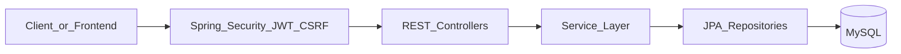
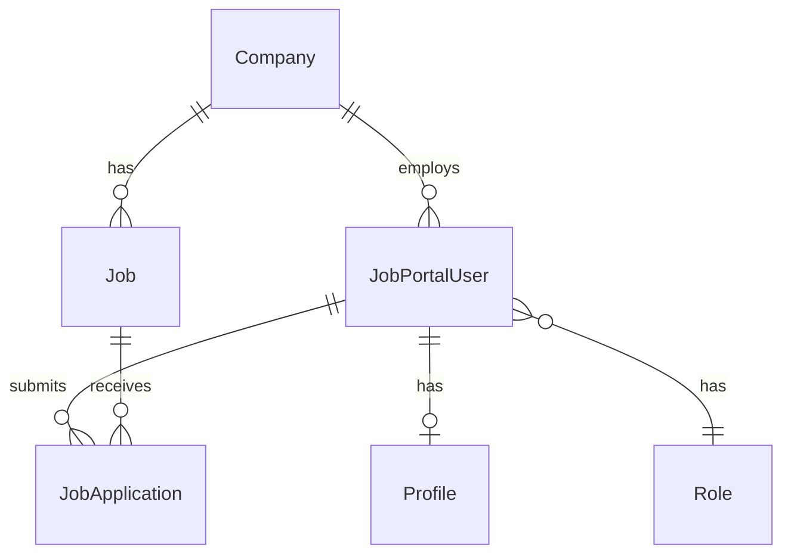

# Job Portal Backend

REST API backend for a job portal application, built as a Spring Boot learning project (EazyBytes-style). It provides authentication, role-based access, company and job management, job seeker profiles and applications, contact handling, caching, observability hooks, and demo integrations with external HTTP APIs.

## Tech stack

| Layer | Technology |
|-------|------------|
| Runtime | Java 25 |
| Framework | Spring Boot 4.0.1 |
| Web | Spring WebMVC, API versioning |
| Persistence | Spring Data JPA, Hibernate 7, MySQL |
| Security | Spring Security, JWT (jjwt), CSRF, CORS |
| Cache | Spring Cache, Caffeine |
| Docs | SpringDoc OpenAPI |
| HTTP clients | RestClient, Spring HttpService |
| Ops | Spring Actuator, OpenTelemetry (optional) |
| Build | Maven |
| Containers | Docker Compose (MySQL, Grafana LGTM) |

## Architecture



All REST controllers are mounted under the `/api` prefix (see `WebConfig`). Versioned endpoints expect the custom media type parameter:

```http
Accept: application/vnd.eazyapp+json;v=1.0
```

### Package layout

```
com.eazybytes.jobportal
├── auth/              Login, registration
├── user/              Job seeker profile, saved jobs, applications
├── job/               Employer job and application management
├── company/           Company CRUD (admin), public listing
├── contact/           Contact form and admin workflows
├── security/          JWT filter, CSRF, CORS, path rules, auth providers
├── client/            JSONPlaceholder proxy (todos, posts)
├── repository/        Spring Data JPA repositories
├── entity/            JPA entities and named queries
├── dto/               Request/response DTOs
├── aspects/           AOP: logging, validation, audit
├── cache/             Caffeine cache configuration
├── audit/             JPA auditing (created/updated by)
├── exception/         Global exception handling
├── config/web/        API prefix and versioning
├── otel/              OpenTelemetry Logback initializer
└── util/              Shared mapping/helpers
```

## Prerequisites

- **JDK 25**
- **Maven 3.9+** (or use the included Maven wrapper)
- **Docker Desktop** (recommended for MySQL; optional for Grafana LGTM observability stack)

## Quick start

### 1. Clone and start MySQL

```powershell
git clone https://github.com/LaNguAx/Portal-FS-SpringBoot-Application.git
cd Portal-FS-SpringBoot-Application
docker compose up -d dbservice
```

MySQL listens on `localhost:3306` with database `jobportal`, user `root`, password `root`. Data is persisted under `./docker/mysql-data` (gitignored).

> **Migrating old data:** If you previously used `C:/Users/Itay/Desktop/JobPortal/jobportal-data`, copy that folder into `./docker/mysql-data` before starting Compose.

### 2. Run the application

```powershell
mvn spring-boot:run
```

Or run `com.eazybytes.jobportal.JobportalApplication` from your IDE.

Spring Boot Docker Compose support can also start services automatically on app boot (`spring.docker.compose.lifecycle-management=start-and-stop`). Ensure Docker Desktop is running when using that behavior.

### 3. Verify

| Service | URL |
|---------|-----|
| API base | http://localhost:8080/api |
| Swagger UI | http://localhost:8080/swagger-ui.html |
| OpenAPI JSON | http://localhost:8080/v3/api-docs |
| Actuator | http://localhost:9090/jobportal/actuator |
| Grafana (optional) | http://localhost:3000 |

Start the full observability stack:

```powershell
docker compose up -d
```

## Configuration

### Property files

| Profile | File | Purpose |
|---------|------|---------|
| Default | `src/main/resources/application.properties` | Local dev: JDBC, SQL init, CORS, cache, Compose lifecycle |
| QA | `src/main/resources/application-qa.properties` | Longer cache TTL, QA CORS origins, OTLP off |
| Prod | `src/main/resources/application-prod.properties` | Compose off, OTLP/tracing off, shorter cache TTL |
| JWT | `src/main/resources/jwt.properties` | Issuer, subject, token TTL |

Activate a profile:

```powershell
mvn spring-boot:run -Dspring-boot.run.arguments=--spring.profiles.active=prod
```

### Environment variables

| Variable | Default | Description |
|----------|---------|-------------|
| `DATABASE_HOST` | `localhost` | MySQL host |
| `DATABASE_PORT` | `3306` | MySQL port |
| `DATABASE_NAME` | `jobportal` | Database name |
| `DATABASE_USERNAME` | `root` | DB user |
| `DATABASE_PASSWORD` | `root` | DB password |
| `JWT_SECRET` | (dev default in code) | HMAC secret for JWT signing — **set in production** |
| `LOG_LEVEL` | `INFO` | Application log level |
| `LOG_LEVEL_ERROR` | `ERROR` | Level for `jobportal_error` log group |
| `SHOW_SQL` | `true` | Hibernate SQL logging (default profile) |
| `HIBERNATE_FORMAT_SQL` | `true` | Format SQL in logs |
| `DEFAULT_BATCH_FETCH_SIZE` | `50` | Hibernate batch fetch size |
| `CONSOLE_LOG_PATTERN` | (colored pattern) | Console log layout |

### Database initialization

On first connection to an **empty** database, Spring runs:

- `classpath:sql/jobportal-schema.sql` — tables (companies, contacts, jobs, users, roles, profiles, applications, etc.)
- `classpath:sql/jobportal-data.sql` — seed data

Configured via:

```properties
spring.sql.init.mode=embedded
spring.sql.init.schema-locations=classpath:sql/jobportal-schema.sql
spring.sql.init.data-locations=classpath:sql/jobportal-data.sql
```

### Docker Compose

[`compose.yml`](compose.yml) defines:

| Service | Image | Ports | Notes |
|---------|-------|-------|-------|
| `dbservice` | `mysql:latest` | 3306 | Container name `jobportaldb` |
| `grafana-lgtm` | `grafana/otel-lgtm:latest` | 3000, 4317, 4318 | Optional metrics/traces/logs collector |

## Security

### Authentication flow

1. **Register** — `POST /api/auth/register/public` (public)
2. **Login** — `POST /api/auth/login/public` returns a JWT and user DTO
3. **Authenticated requests** — send `Authorization: Bearer <token>`
4. **CSRF** (browser clients) — fetch `GET /api/csrf-token/public`, send CSRF token with mutating requests; cookie-based CSRF is enabled for non-actuator routes

JWT validation is handled by `JwtTokenValidatorFilter` before controller logic. Public paths are listed in `PathsConfig` and skipped by the filter.

### Roles

| Role constant | Spring `hasRole` | Typical use |
|---------------|------------------|-------------|
| `ROLE_JOB_SEEKER` | `JOB_SEEKER` | Profile, saved jobs, applications |
| `ROLE_EMPLOYER` | `EMPLOYER` | Post and manage jobs, review applications |
| `ROLE_ADMIN` | `ADMIN` | Companies, contacts, user administration |

### Auth providers

| Provider | Profile | Behavior |
|----------|---------|----------|
| `JobPortalNonProdUsernamePwdAuthenticationProvider` | `!prod` | Loads user by email; **does not verify password** (local/demo convenience) |
| `JobPortalUsernamePwdAuthenticationProvider` | `prod` | Loads user and verifies password with BCrypt |

### Authorization

`JobPortalSecurityConfig` applies rules in order:

1. **Public** paths — `permitAll`
2. **Admin** paths — `hasRole("ADMIN")`
3. **Employer** paths — `hasRole("EMPLOYER")`
4. **Job seeker** paths — `hasRole("JOB_SEEKER")`
5. **All other** `/api/**` — `authenticated()`
6. Anything else — `denyAll`

Path patterns use Ant-style wildcards (`*`) for IDs, e.g. `/api/users/saved-jobs/*/jobseeker`.

### CORS

Configured via `app.cors.*` properties and `CorsProperties`. Default origins include `http://localhost:5173` (Vite) and EazyBytes dev hostnames. Credentials are allowed (`allow-credentials=true`).

### Production checklist

- Set `JWT_SECRET` environment variable
- Run with `--spring.profiles.active=prod`
- Restrict actuator exposure and disable unnecessary endpoints
- Use strong database credentials
- Do not rely on non-prod auth provider behavior

## API reference

Base path: **`/api`**. Version **`1.0`** via `Accept: application/vnd.eazyapp+json;v=1.0` unless noted.

### Authentication (public)

| Method | Path | Description |
|--------|------|-------------|
| POST | `/auth/login/public` | Login; returns JWT + user |
| POST | `/auth/register/public` | Register job seeker |

### CSRF and utilities (public)

| Method | Path | Description |
|--------|------|-------------|
| GET | `/csrf-token/public` | CSRF token for browser clients |
| GET | `/logging/public` | Logging demo endpoint |
| GET | `/companies/public` | List companies (public) |
| POST | `/contacts/public` | Submit contact form |

### Job seeker (`ROLE_JOB_SEEKER`)

| Method | Path | Description |
|--------|------|-------------|
| GET | `/users/profile/jobseeker` | Get profile |
| PUT | `/users/profile/jobseeker` | Update profile |
| GET | `/users/profile/picture/jobseeker` | Profile picture |
| GET | `/users/profile/resume/jobseeker` | Resume |
| GET | `/users/saved-jobs/jobseeker` | List saved jobs |
| POST | `/users/saved-jobs/{jobId}/jobseeker` | Save a job |
| DELETE | `/users/saved-jobs/{jobId}/jobseeker` | Unsave a job |
| GET | `/users/job-applications/jobseeker` | List applications |
| POST | `/users/job-applications/jobseeker` | Apply to a job |
| DELETE | `/users/job-applications/{jobId}/jobseeker` | Withdraw application |

### Employer (`ROLE_EMPLOYER`)

| Method | Path | Description |
|--------|------|-------------|
| GET | `/jobs/employer` | List employer jobs |
| POST | `/jobs/employer` | Create job |
| PATCH | `/jobs/{jobId}/status/employer` | Update job status |
| GET | `/jobs/applications/{jobId}/employer` | Applications for a job |
| PATCH | `/jobs/applications/employer` | Update application status |

### Admin (`ROLE_ADMIN`)

| Method | Path | Description |
|--------|------|-------------|
| GET | `/contacts/admin` | List contacts |
| GET | `/contacts/sort/admin` | Sorted contacts |
| GET | `/contacts/page/admin` | Paginated contacts |
| PATCH | `/contacts/{id}/status/admin` | Update contact status |
| GET | `/companies/admin` | List companies |
| POST | `/companies/admin` | Create company |
| PUT | `/companies/{id}/admin` | Update company |
| DELETE | `/companies/{id}/admin` | Delete company |
| GET | `/users/search/admin` | Search users |
| PATCH | `/users/{userId}/role/employer/admin` | Assign employer role |
| PATCH | `/users/{userId}/company/{companyId}/admin` | Link user to company |

### Demo / external proxies (public)

Unauthenticated proxies to [JSONPlaceholder](https://jsonplaceholder.typicode.com):

| Resource | Base path |
|----------|-----------|
| Todos | `/api/todos` |
| Posts | `/api/posts` |

### Example: login and authenticated request

```powershell
# Login
curl -X POST http://localhost:8080/api/auth/login/public `
  -H "Content-Type: application/json" `
  -H "Accept: application/vnd.eazyapp+json;v=1.0" `
  -d '{"username":"user@example.com","password":"secret"}'

# Use token (replace TOKEN)
curl http://localhost:8080/api/users/profile/jobseeker `
  -H "Authorization: Bearer TOKEN" `
  -H "Accept: application/vnd.eazyapp+json;v=1.0"
```

## Data model



| Entity | Table | Notes |
|--------|-------|-------|
| `Company` | `companies` | Jobs, ratings, industry metadata |
| `Job` | `jobs` | Belongs to company; status, salary, requirements |
| `JobPortalUser` | `users` | Email login, role, optional company link |
| `Profile` | `profiles` | Job seeker resume, skills, picture |
| `Role` | `roles` | JOB_SEEKER, EMPLOYER, ADMIN |
| `Contact` | `contacts` | Inquiries with status workflow |
| `JobApplication` | `job_applications` | Seeker applications to jobs |
| `BaseEntity` | (mapped columns) | `createdAt`, `createdBy`, `updatedAt`, `updatedBy` |

JPA auditing populates audit fields via `AuditorAwareImpl` and the authenticated principal.

## Cross-cutting features

### Caching

`CaffeineCacheConfig` defines caches for `jobs`, `companies`, and `roles` with TTL and size limits from `cache.*` properties.

### AOP

| Aspect | Purpose |
|--------|---------|
| `LoggingAndPerformanceAspect` | Method entry/exit and timing |
| `RegisterValidationAspect` | Registration validation |
| `LoginSuccessAuditAspect` | Audit successful logins |
| `ExceptionAuditAspect` | Audit exceptions |

### Observability

- **Actuator** on port `9090`, base path `/jobportal/actuator`
- **OTLP** export is disabled in default and QA profiles; enable in properties when `grafana-lgtm` is running on port `4318`
- **Logback** — `logback-spring.xml` supports file and OpenTelemetry appenders

### API documentation

SpringDoc serves Swagger UI at `/swagger-ui.html` and OpenAPI 3 docs at `/v3/api-docs`.

## Testing

```powershell
mvn test
```

Tests use an in-memory **H2** database (`src/test/resources/application.properties`):

- Docker Compose disabled
- SQL init disabled
- `ddl-auto=create-drop` for schema per test run

## Build and deployment

```powershell
mvn clean package
```

Produces: `target/jobportal-aws-deployment.jar`

Run the JAR:

```powershell
java -jar target/jobportal-aws-deployment.jar --spring.profiles.active=prod
```

## Troubleshooting

| Issue | What to check |
|-------|----------------|
| `Communications link failure` | Docker running? `docker compose up -d dbservice`. Port 3306 free? |
| Tables missing | Empty DB? SQL init runs on first empty database. Delete `./docker/mysql-data` only if you want a full reset. |
| CORS errors from frontend | Origin must match `app.cors.allowed-origins` (default `http://localhost:5173`). |
| 403 on mutating requests | CSRF token required for browser clients; include token from `/api/csrf-token/public`. |
| 403 on role-specific routes | JWT present? User has correct role? Path patterns use `*` for IDs. |
| OTLP connection errors | Disable OTLP in properties or start `grafana-lgtm` service. |
| Login works with any password (local) | Expected with `@Profile("!prod")` non-prod auth provider. Use `prod` profile for password checks. |

## Project structure (repository root)

```
backend/
├── compose.yml              Docker Compose services
├── pom.xml                  Maven build
├── README.md                This file
├── src/main/java/           Application source
├── src/main/resources/      Config, SQL scripts, logback
├── src/test/                Tests and test config
└── docker/mysql-data/       MySQL data (gitignored, created at runtime)
```

## License and attribution

Educational project based on the EazyBytes Job Portal course curriculum. Use and modify for learning purposes; configure secrets and security before any production deployment.
